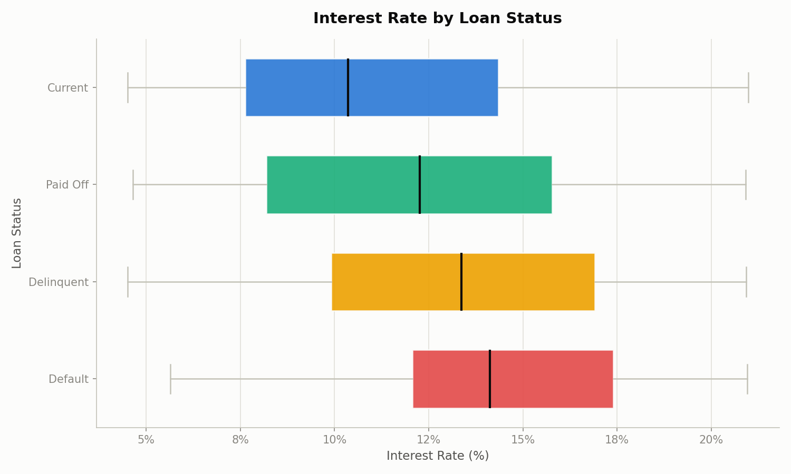

# EDA Interest Rate by Loan Status — wildcat_loans_clean.csv

Output of `scripts/eda_box_interest_by_status.py` run against `02_Data/Raw/wildcat_loans_clean.csv`.

Chart saved to `outputs/box_interest_by_status.png` — horizontal box plot of `interest_rate` across the four `loan_status` categories.

## Summary statistics by loan_status

| loan_status | Count | Mean | Std | Min | 25th % | Median | 75th % | Max |
|---|---|---|---|---|---|---|---|---|
| Current | 1454 | 11.35 | 4.42 | 4.50 | 7.63 | 10.36 | 14.35 | 20.98 |
| Paid Off | 532 | 12.21 | 4.54 | 4.64 | 8.19 | 12.26 | 15.77 | 20.91 |
| Delinquent | 248 | 13.36 | 4.31 | 4.51 | 9.92 | 13.36 | 16.92 | 20.93 |
| Default | 106 | 14.23 | 3.93 | 5.64 | 12.07 | 14.12 | 17.40 | 20.95 |

## Interpretation

Median interest rate rises step by step as loan health worsens: **Current (10.36%) → Paid Off (12.26%) → Delinquent (13.36%) → Default (14.12%)**. Default loans also have the tightest spread (25th–75th percentile: 12.07%–17.40%) and the highest floor of any group, meaning even the lowest-rate default loans still carry a fairly high rate. This is consistent with higher-risk borrowers being priced with higher interest rates from origination — the loans that end up delinquent or in default were, on average, already the more expensive ones.
