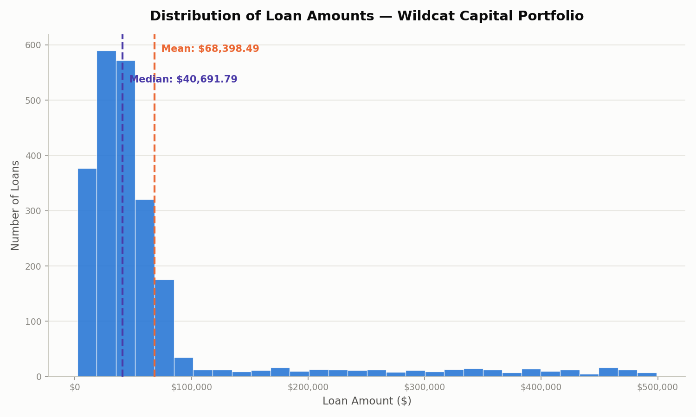

# EDA Loan Amount Histogram — wildcat_loans_clean.csv

Output of `scripts/eda_hist_loan_amount.py` run against `02_Data/Raw/wildcat_loans_clean.csv`.

Chart saved to `outputs/hist_loan_amount.png` — 30 bins, with labeled vertical lines at the mean and median.

## Summary statistics shown on the chart

| Statistic | Value |
|---|---|
| Mean loan_amount | $68,398.49 |
| Median loan_amount | $40,691.79 |

## Interpretation

The mean sits well above the median ($68,398.49 vs. $40,691.79), and the histogram confirms why: most loans cluster under $100,000, but a long right tail of larger loans (stretching out toward $500,000) pulls the mean upward. This right-skewed shape means the median is a more representative "typical loan size" than the mean for this portfolio.
