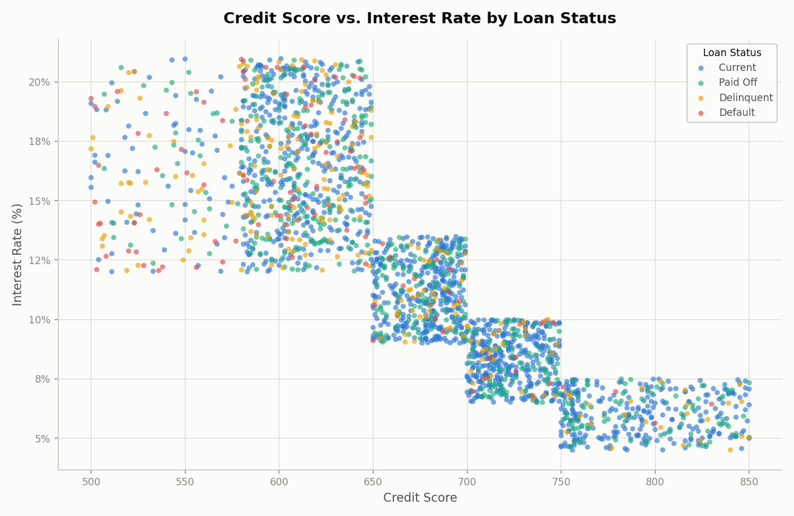

# EDA Credit Score vs. Interest Rate Scatter — wildcat_loans_clean.csv

Output of `scripts/eda_scatter_credit_rate.py` run against `02_Data/Raw/wildcat_loans_clean.csv`.

Chart saved to `outputs/scatter_credit_rate.png` — credit_score (x-axis) vs. interest_rate (y-axis), points colored by loan_status.

## Interpretation

The scatter confirms the -0.84 correlation found earlier, but it also reveals *how* that relationship is structured: rather than a smooth downward slope, the points fall into distinct **credit score bands**, each with its own interest rate range — roughly 500–580, 580–650, 650–700, 700–750, and 750–850. This looks like risk-based pricing tiers (similar to standard credit-tier bands like Poor/Fair/Good/Very Good/Exceptional) rather than a continuous rate calculation from raw score.

Within each band, all four `loan_status` categories are mixed together — Delinquent (yellow) and Default (red) points don't cluster in a distinct sub-region of a given band, they're scattered throughout it. That suggests credit score (via its tier) drives the interest rate a borrower is offered, but doesn't fully determine whether that specific loan ends up delinquent or in default — other factors (or simply chance) still play a role once a borrower is priced into a tier. The lowest tier (roughly 500–580, rates ~12–21%) does still show a visibly higher concentration of Delinquent and Default points than the highest tier (750+, rates ~5–8%), consistent with the earlier finding that worse-performing loans skew toward lower credit scores and higher rates overall.
